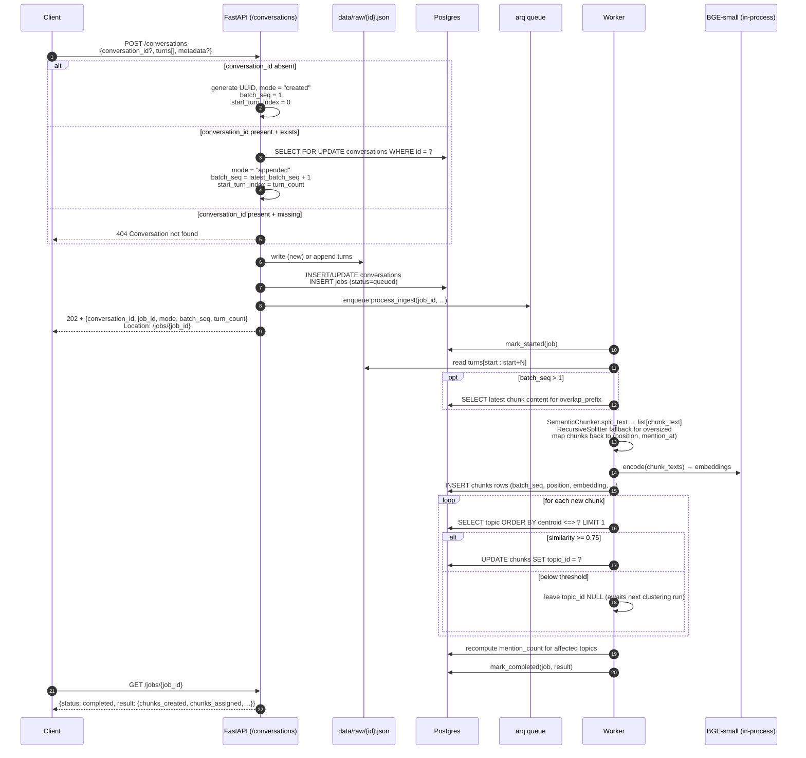
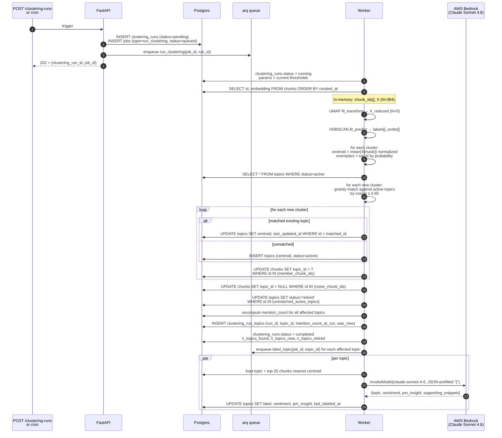
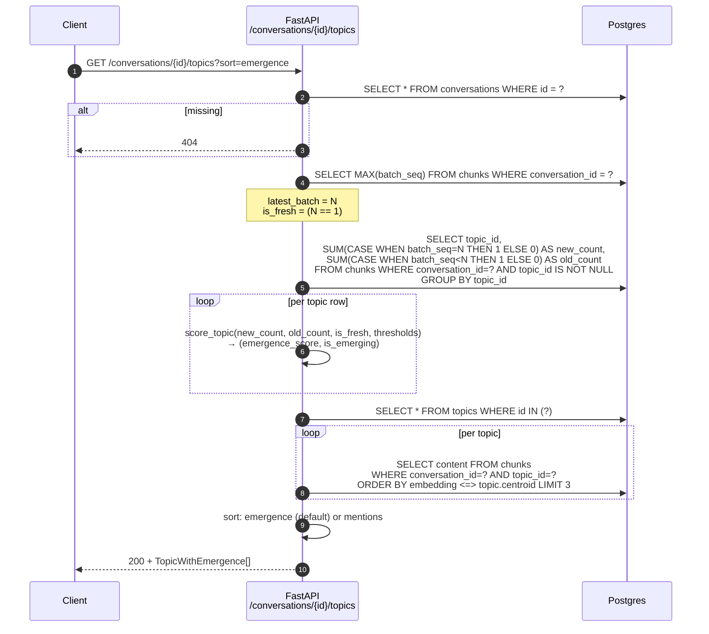

# Data flow

Sequence diagrams for the three primary flows. Rendered via Mermaid — paste any block into [mermaid.live](https://mermaid.live) for a visual view, or view this file in a Mermaid-aware Markdown renderer.

## 1. Ingest (new or append)

## 2. Full clustering run

## 3. Per-conversation emergence query

